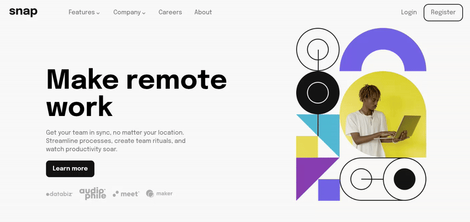

# Frontend Mentor - Intro section with dropdown navigation solution

This is a solution to the [Intro section with dropdown navigation challenge on Frontend Mentor](https://www.frontendmentor.io/challenges/intro-section-with-dropdown-navigation-ryaPetHE5). Frontend Mentor challenges help you improve your coding skills by building realistic projects. 

## Table of contents

- [Overview](#overview)
  - [The challenge](#the-challenge)
  - [Screenshot](#screenshot)
  - [Links](#links)
- [My process](#my-process)
  - [Built with](#built-with)
  - [What I learned](#what-i-learned)
  - [Continued development](#continued-development)
  - [Useful resources](#useful-resources)
- [Author](#author)
- [Acknowledgments](#acknowledgments)

**Note: Delete this note and update the table of contents based on what sections you keep.**

## Overview

### The challenge

Users should be able to:

- View the relevant dropdown menus on desktop and mobile when interacting with the navigation links
- View the optimal layout for the content depending on their device's screen size
- See hover states for all interactive elements on the page

### Screenshot

### Links

- Solution URL: [Solution](https://your-solution-url.com)
- Live Site URL: [Live site](https://your-live-site-url.com)

## My process

### Built with

- Semantic HTML5 markup
- CSS custom properties
- Flexbox
- Mobile-first workflow
- Javasctipt DOM Manipulaton
- Event Delegation

### What I learned

During the development of the project, I learnt more about event delegation. It is a topic that I will continue to study in order to implement the DRY principle wherever possible in future projects. I gained a better understanding of responsive images and their properties, as well as accessibility and user interaction. This is an important area for me to improve in as a developer.

### Continued development

I want to improve my ability to create fluid and responsive layouts. I don't yet consider myself capable of developing any type of layout, so I want to devote more time to studying documentation in order to consolidate my knowledge of web development.

### Useful resources

- [MDN Documentation](https://developer.mozilla.org/en-US/)

## Author

- Frontend Mentor - [@yourusername](https://www.frontendmentor.io/profile/viniciusfrsantos2)